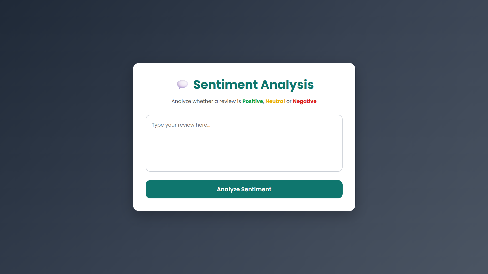
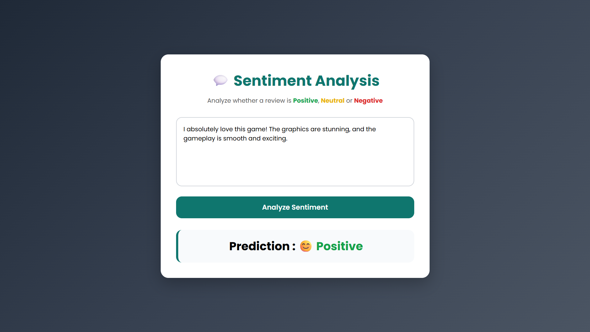
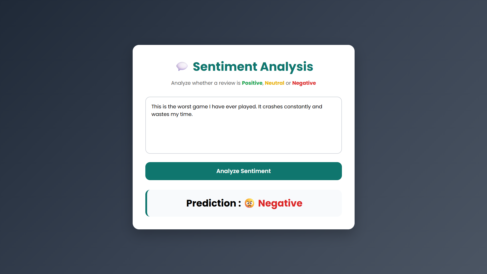
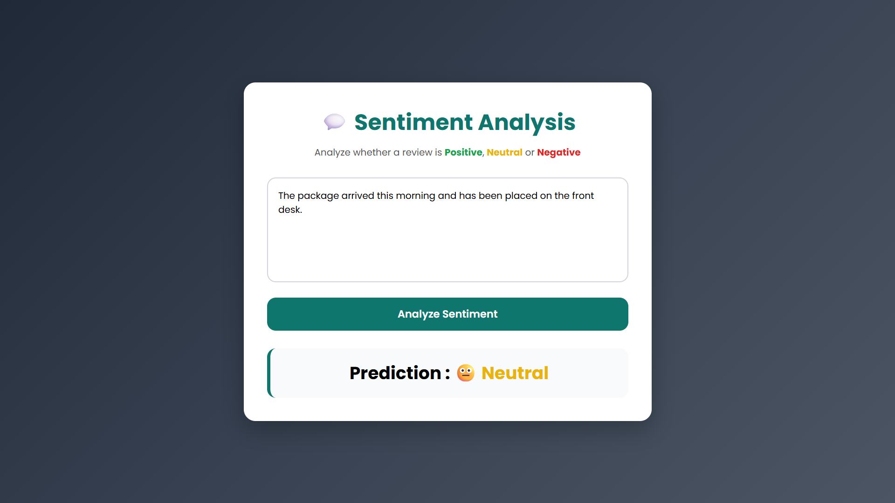

# 💬 AI Sentiment Analysis

A simple Machine Learning web application that predicts whether a given text is **Positive**, **Negative**, or **Neutral**.

This project was built using **Python, Flask, TF-IDF, and Logistic Regression**. Users can enter any review or sentence, and the application predicts its sentiment instantly.


https://github.com/user-attachments/assets/1d0ed9ca-c1de-4fb6-85b7-6c2832258e36


---

## 🚀 Features

- Predicts Positive, Negative, and Neutral sentiments
- Simple and clean user interface
- Text preprocessing before prediction
- Machine Learning model trained using Logistic Regression
- Flask-based web application

---

## 🛠️ Tech Stack

- Python
- Flask
- HTML
- CSS
- Scikit-learn
- Pandas

---

## 🤖 Machine Learning

- **Vectorization:** TF-IDF
- **Algorithm:** Logistic Regression
- **Accuracy:** ~76%

---

## 📂 Project Structure

```
AI-Sentiment-Analysis/
│
├── dataset/
│   ├── cleaned_sentiment.csv
│   ├── sentiment.csv
│   └── data_cleaning.ipynb
│
├── static/
│   └── style.css
│
├── templates/
│   └── index.html
│
├── app.py
├── train_model.ipynb
├── model.pkl
├── vectorizer.pkl
├── requirements.txt
└── README.md
```


---

## 📷 Application Output

### 🏠 Home Page



---

### 😊 Positive Prediction



---

### 😠 Negative Prediction



---

### 😐 Neutral Prediction



---

